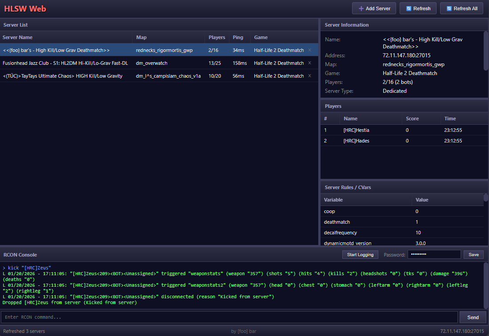

# HLSW Web

A web-based game server browser inspired by the classic HLSW (Half-Life Server Watch) desktop application. Monitor and manage Source and GoldSrc game servers from your browser.



## Features

- Query Source Engine servers (CS:GO, CS2, TF2, Garry's Mod, HL2MP, etc.)
- Query GoldSrc servers (Half-Life, Counter-Strike 1.6, etc.)
- View server information, player lists, and server rules/CVars
- RCON console for remote server administration
- Real-time server log streaming (experimental)
- Player management (right-click to kick/ban)
- Auto-refresh with 30-second intervals
- Server list persisted in browser localStorage
- Dark theme UI

## Requirements

- PHP 7.0+ with sockets extension enabled
- Web server (Apache, nginx, etc.)
- UDP port range 28000-29000 accessible for log receiving (optional)

## Installation

1. Clone or copy files to your web server directory
2. Point your web server document root to `public_html/`
3. Copy `etc/config.example.php` to `etc/config.php` and configure as needed
4. Ensure PHP has UDP/TCP socket access (may require firewall configuration)
5. Access `index.php` in your browser

## Configuration

Copy `etc/config.example.php` to `etc/config.php`:

```php
return [
    // 'auto' = detect via public IP services, or set manual IP
    'log_receiver_ip' => 'auto',

    // UDP port range for log receiver
    'log_receiver_port_min' => 28000,
    'log_receiver_port_max' => 29000,

    // Log session timeout in seconds (0 = no timeout)
    'log_receiver_timeout' => 900, // 15 minutes
];
```

## Usage

### Basic Usage
1. Click "Add Server" to add a game server by IP:Port
2. Select a server to view its details
3. Double-click a server to refresh its information

### RCON Console
1. Enter the RCON password and click "Save"
2. Type commands in the input field and press Enter or click "Send"

### Real-time Logging (Experimental)

> **Note:** This feature is experimental and untested. It may not work in all environments.

1. Ensure `etc/config.php` is configured with the correct IP
2. Select a server and enter the RCON password
3. Click "Start Logging" to receive real-time server logs
4. Logs appear in the RCON console

### Player Management
- Right-click on a player in the player list to kick or ban them (requires RCON password)

## Files

```
├── etc/
│   └── config.example.php    # Configuration template
├── public_html/
│   ├── index.php             # Main HTML interface
│   ├── app.js                # Frontend JavaScript application
│   ├── style.css             # Styling
│   ├── query.php             # A2S query proxy (server info, players, rules)
│   ├── rcon.php              # RCON command proxy (Source and GoldSrc)
│   └── log_receiver.php      # Real-time log receiver (SSE + UDP)
├── screenshots/
│   └── screenshot1.png
└── README.md
```

## Troubleshooting

### RCON Connection Timeout
If RCON fails to connect but server queries work, the game server may only be listening on localhost. Add to your server.cfg:
```
ip 0.0.0.0
```

### Logs Not Appearing
- Verify `log_receiver_ip` in config.php is reachable from the game server
- Check that UDP ports 28000-29000 are not blocked by firewall
- Ensure the game server can send outbound UDP to your web server

## License

AGPL-3.0
